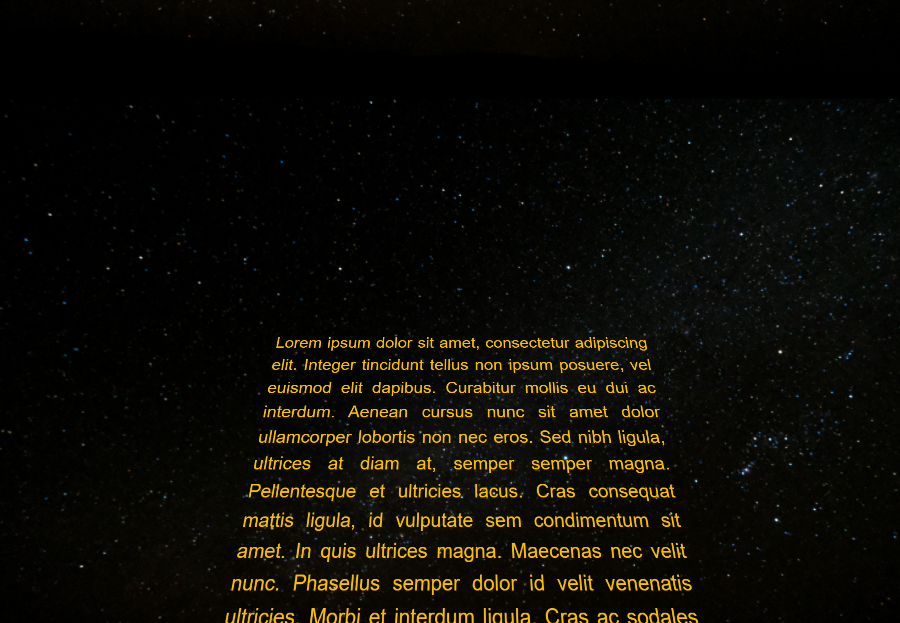

This project implements the famous "Star Wars" opening text in space effect using pure CSS:

  

## Replace Placeholders

This file uses text placeholders, replace them with the actual values:

* `{domain}` - Web domain of the project, for example `starwars.local`
* `{project}` - project directory name, for example `starwars`
* `{home_dir}` - home directory where the project is installed, for example, `/home/vagrant` 
* `{php}` - PHP version, for example `php7.3`
* `{ip}` - server's IP address, for example `192.168.10.10`             

## Installation

1. Install and prepare the project directory:

        git clone https://github.com/osmianski/starwars.git {project}
        cd {project}
        composer install

2. Add the project to your web server configuration, see "Apache" / 
"Nginx" sections below.

## Usage   

Open <http://{domain}/> in the browser and you should see a working page. Edit 
the text in the `index.md` file and refresh the page in the browser.      

## Apache

Under Apache, no additional configuration is needed - just put the project directory under the web site root directory.

## Nginx        

1. Add `/etc/nginx/sites-available/{domain}` file to it:

        server {
            server_name {domain};
        
            root {home_dir}/{project};
        
            index index.html index.php;
        
            location / {
                try_files $uri $uri/ /index.php?$query_string;
            }
        
            location = /favicon.ico { access_log off; log_not_found off; }
            location = /robots.txt  { access_log off; log_not_found off; }
        
            access_log off;
            error_log  /var/log/nginx/{domain}-error.log error;
        
            sendfile off;
        
            client_max_body_size 100m;
        
            location ~ \.php$ {
                fastcgi_split_path_info ^(.+\.php)(/.+)$;
                fastcgi_pass unix:/var/run/php/{php}-fpm.sock;
                fastcgi_index index.php;
                include fastcgi_params;
                fastcgi_param SCRIPT_FILENAME $document_root$fastcgi_script_name;
        
                fastcgi_intercept_errors off;
                fastcgi_buffer_size 16k;
                fastcgi_buffers 4 16k;
                fastcgi_connect_timeout 300;
                fastcgi_send_timeout 300;
                fastcgi_read_timeout 300;
            }
        
            location ~ /\.ht {
                deny all;
            }
        }

2. Let Nginx read the configuration file:
    
        sudo ln -s /etc/nginx/sites-available/{domain} /etc/nginx/sites-enabled/{domain}
        sudo service nginx restart
        
3. Add `{domain}` to your local hosts file manually or use `hosts` command:
    
        hosts add {ip} {domain}     
        
## License And Credits

Licensed under GPL v3, see `LICENSE` file for more details.

For the background I used <https://get.pxhere.com/photo/astronomy-constellation-dark-galaxy-night-night-sky-orion-space-starry-sky-stars-universe-1563485.jpg>.

The CSS effect is adapted from <https://css-tricks.com/snippets/css/star-wars-crawl-text/>.        